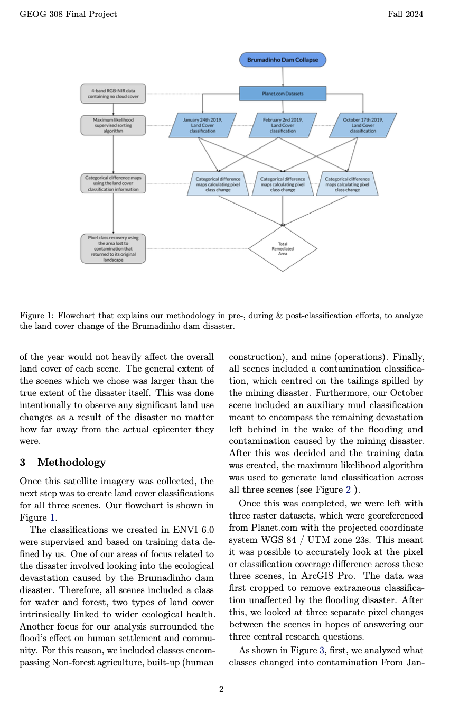
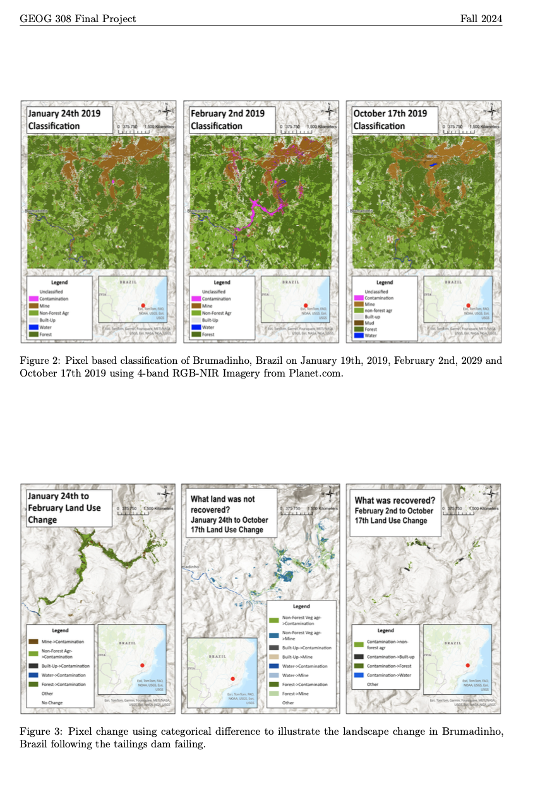
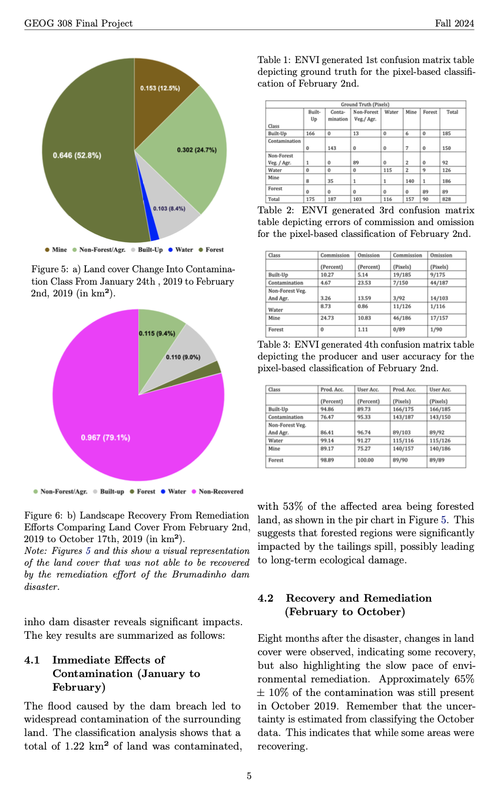

# Geospatical Analysis on Brummadinho Dam Disaster in 2019
Project Report see [PDF](project.pdf).
Simple interactive web visualization see [website](https://asahahaha.github.io/geospatial-brumadinho/).

  
  
  

